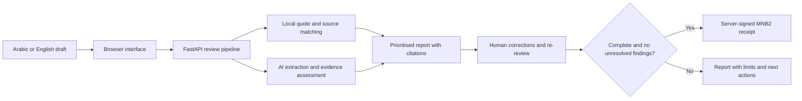

# مَنبَع | Manba

**مراجعة المحتوى الشرعي قبل النشر، مع الرجوع إلى المصدر.**

Manba helps a khateeb, teacher, translator, or content team review religious text before publishing it. Paste a draft, see the passages that need attention, inspect their sources, apply corrections, and review the corrected text again.

**[Open the live application](https://manba-psi.vercel.app/)** · [How it works](https://manba-psi.vercel.app/#how) · [Verify a badge](https://manba-psi.vercel.app/#verify) · [Sources and licences](SOURCES.md)

## For judges: start here

1. Open the application and choose one of the **six examples** below the text box. They open labelled, saved reports without an access code. They demonstrate the workflow and do not issue badges.
2. Inspect the numbered highlights and source cards. The khutbah example includes an altered verse, a hadith attribution that needs attention, and a claimed consensus on a disputed fiqh issue.
3. Open the corrected draft. Apply the suggested corrections where available; handle disputed rulings manually. The application preserves your edits.
4. **Your link works out of the box.** The link the team sent you already carries the access code (it ends in `#code=…`). Opening it saves the code in your browser and removes it from the address bar, so you can paste a new text and press **Review the text** at once; nothing needs to be entered in Settings. The code stays in that browser, so use the same browser again and a normal window, not a private one. If you do not have the link, ask the team for the access code and save it in **Settings → Access**. The hosted AI key is supplied by the server. Arabic, English, and appearance options are in Settings. The first request after the site has been idle can take 20–25 seconds.
5. Reports can be copied, shared, or printed to PDF. A new badge is available only when the server completes the required review and no unresolved findings remain.

**للتجربة السريعة:** افتح أحد الأمثلة الستة دون رمز دخول، ثم راجع المواضع المظللة ومصادرها والنص المصحح. لمراجعة نص جديد افتح الرابط الذي أرسله لك الفريق: فهو يحمل رمز الدخول، فيحفظه في متصفحك ويخفيه من شريط العنوان، وتلصق نصك مباشرة دون المرور بالإعدادات (استخدم نافذة عادية لا خاصة، ونفس المتصفح في كل مرة). الأمثلة المحفوظة لا تمنح شارة.

## What Manba checks

| Content | How it is reviewed | What the reader receives |
|---|---|---|
| Quran quotations | Local matching against Tanzil, with checks for altered words and supplied vowel marks in aligned wording | Surah, verse number, reference text, and differences |
| Hadith quotations | Search the nine-book local corpus; recorded grades and on-demand Dorar results where available | Book, available numbering, recorded grades, and missing-source or missing-grade notices |
| Fiqh statements | Search the Kuwaiti Fiqh Encyclopedia for recorded agreement, disagreement, and school attributions | Volume/page and source passage; flags for claimed consensus or disputed rulings presented as settled |
| Other religious claims | AI-assisted extraction, retrieval, and assessment of source relevance | Cited evidence requiring human review; model assessments cannot certify a claim |
| Quotations in other languages | Compare the included Quran translations and English hadith corpus, linked to Arabic sources | Translation attribution, original source, and discrepancies |

Manba is an automated review aid. It does **not** issue fatwas, choose a preferred school, guarantee that it found every claim, or establish that no authentic source exists when a search returns no match.

## Signed badges and serial verification

A badge is a receipt for a particular automated review, rather than a religious endorsement.

- Current serials begin with **`MNB2-`**. The server encodes the review date and a 128-bit SHA-256 text fingerprint, signed with a 128-bit HMAC using the dedicated `BADGE_SECRET`.
- Issuance requires full review mode, successful AI processing, no skipped or truncated work, at least one checked item, and no unresolved findings. Limited reviews and saved examples cannot earn a badge.
- Anyone can open **Verify** and enter the complete serial. Adding the reviewed text checks its exact UTF-8 fingerprint, including whitespace and line breaks. A valid serial alone does not authenticate a different text printed beside it.
- SVG badges supply their serial without an AI call. Reading a serial from an image may require an access code and a model; PDF text extraction is attempted first.
- Retired `MNB-` serials are rejected. Keep `BADGE_SECRET` stable: replacing it invalidates issued receipts. An existing receipt records its review date and is not a fresh review.

The paths are in [`badge.py`](app/services/badge.py), the [public badge routes](app/routers/badge.py), and the [interface](app/static/app.js).

## Architecture



Python/FastAPI, Pydantic, NumPy, and a plain JavaScript interface power the application. Source indexes are built when the server starts. OpenRouter and Google Gemini are supported model providers. Vercel hosts the application; no user-text database is used.

## Run locally

Requires **Python 3.12**. Prepared corpus files are included; ingestion scripts support reproducibility.

```bash
python -m venv .venv
# Windows PowerShell:
.venv\Scripts\Activate.ps1
# macOS/Linux: source .venv/bin/activate
pip install -r requirements.txt
# Copy .env.example to .env and configure the needed values.
uvicorn app.main:app --reload
```

Open `http://127.0.0.1:8000/`. API documentation is at `/docs`. Startup builds local indexes, so the first request after a cold start can take longer.

| Setting | Purpose |
|---|---|
| `OPENROUTER_API_KEY` or `GEMINI_API_KEY` | Server-side AI access; a personal key can instead be supplied in Settings for a request |
| `API_ACCESS_TOKEN` | Protect arbitrary reviews and other model-backed endpoints; share with judges privately |
| `BADGE_SECRET` | Independent signing secret of at least 32 UTF-8 bytes, generated randomly and kept stable |
| `LLM_PROVIDER`, `LLM_MODEL`, `JUDGE_MODEL` | Optional provider/model overrides; see `.env.example` and `app/services/llm_extractor.py` |

On Vercel, set variables for the intended environment and **redeploy after changing server environment variables**. Saving a personal key in the application affects subsequent requests without redeployment. Never publish access codes or keys.

## Privacy, sources, and scope

Text is processed in server memory and may reach model providers during AI steps. Model caches reuse results for up to six hours; unused entries may remain in process memory until eviction or restart. Dorar lookups have a separate cache. Shared report and badge links include the text: anyone receiving the link can read it. Personal provider keys and the access code are saved in browser storage when Settings is saved, or when a judges' link (`#code=…`) is opened; the part after `#` is never sent to the server, and the page removes it from the address bar at once. Access codes are shared privately and never published here.

Code is licensed under [MIT](LICENSE). **Data has separate source terms.** Tanzil attribution is preserved. Permissions for parts of the hadith corpus, the Kuwaiti encyclopedia, al-Muyassar, English hadith translations, and Dorar access remain unresolved in [SOURCES.md](SOURCES.md); public availability alone does not settle redistribution rights.

The review has input and processing limits. Missing grades, uncertain matches, provider failures, personal fatwa questions, and unresolved disagreement need further review. No general accuracy percentage is claimed. Authored evaluation cases are in `golden/`, evaluators in `evals/`, and regression coverage in `tests/`; they do not replace independent scholarly validation.

## Hackathon provenance and team

[BASELINE.md](BASELINE.md) declares earlier work; tag [`v0-baseline`](https://github.com/uAnu0/manba/tree/v0-baseline) marks that version. [CHANGELOG.md](CHANGELOG.md) records work during 4–6 October 2026. Source contents and original commit dates are preserved when contribution metadata is cleaned.

- [uAnu0](https://github.com/uAnu0)
- [Hssan-kms](https://github.com/Hssan-kms)

For access to a live review during judging, contact the team rather than posting credentials in an issue.
